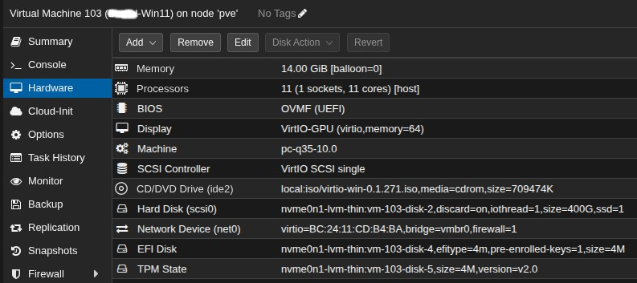
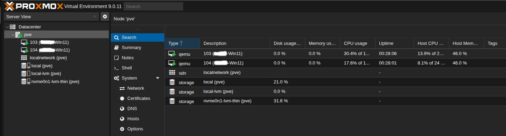
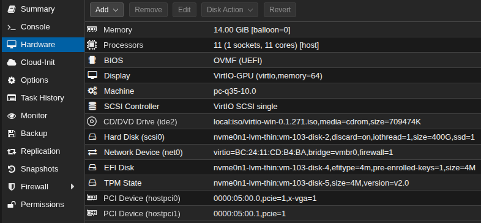
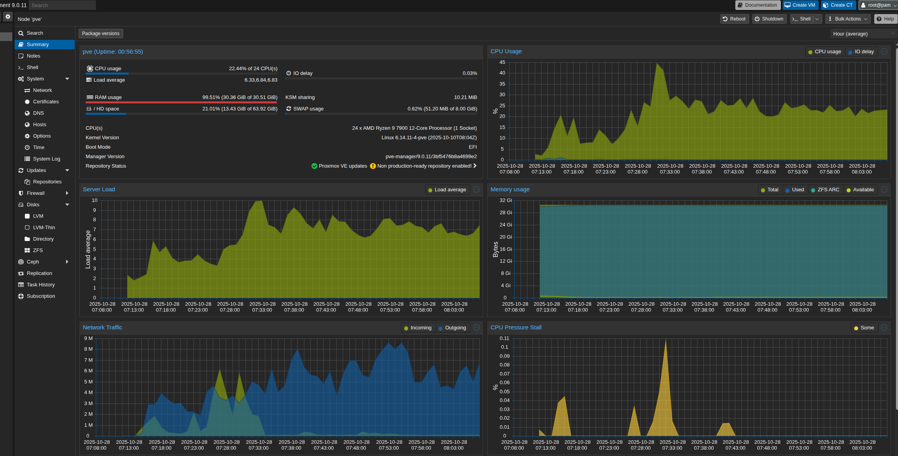
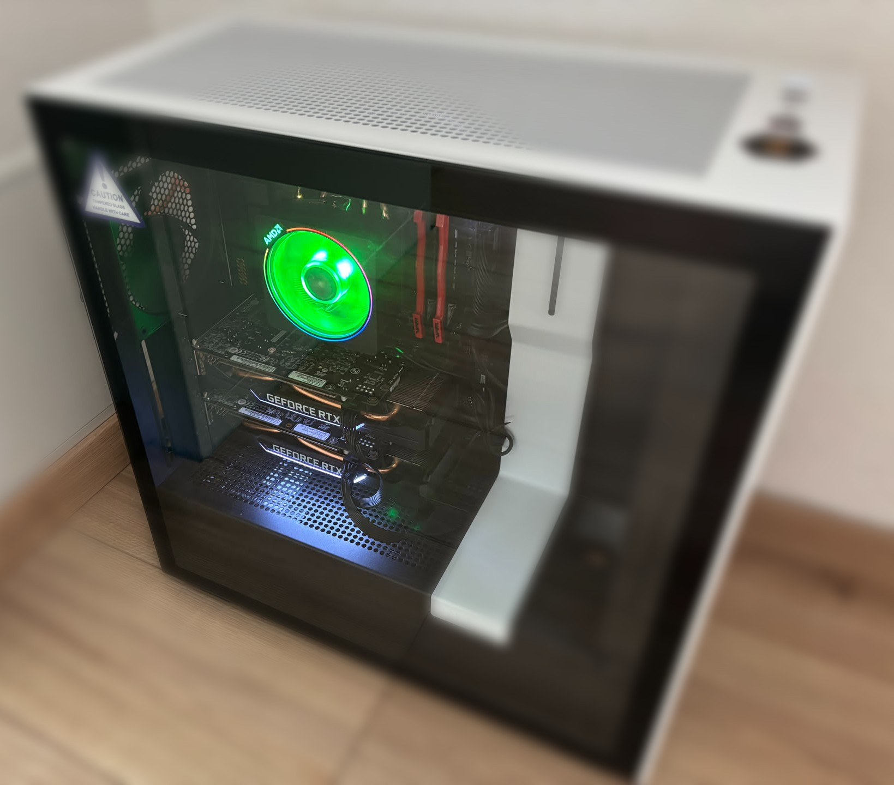

# ProxBi 

Build a server with multiple GPU-powered virtual machines — perfect for families, classrooms, and homelab enthusiasts.
I personally used it for a server for my 3 kids so I do not have to buy a separate PC for each of them and learn something new - in the end it was a successful and interesting project.

---

## Table of Contents
1. [Overview](#overview)
2. [Features](#features)
3. [Hardware Requirements](#hardware-requirements)
4. [Quick / Automated Start](#quick-or-automated-start)
5. [Setup Instructions](#setup-instructions)
6. [Templates & Scripts](#templates--scripts)
7. [Demo & Video](#demo--video)
8. [Support & Sponsorship](#support--sponsorship)
9. [Bonus](#bonus)

---

## Overview
**ProxBi** helps you convert one powerful server into multiple independent desktops for gaming, learning, or productivity. Each user gets their own GPU-powered VM accessible via thin clients or remote desktop.

### One Server vs Separate Server per User

| Feature / Factor              | One Server + Thin Clients                                                             | Separate Server per User                                  |
|-------------------------------|---------------------------------------------------------------------------------------|-----------------------------------------------------------|
| **Hardware Cost**             | Lower — shared components (MB, CPU, PSU, case) reduce overall cost                    | Higher — each user needs a full system                    |
| **GPU Allocation**            | Multiple GPUs passed through to different VMs                                         | Each user requires their own GPU                          |
| **Noise**                     | Minimal in user rooms — server can be placed in a locker, basement, or dedicated room | High — each system produces its own noise                 |
| **Power Consumption**         | Lower — single system with shared components                                          | Higher — many separate systems                            |
| **Maintenance**               | Centralized updates and monitoring                                                    | More effort — updates and troubleshooting for each system |
| **Space Requirements**        | Compact — one server, small thin clients                                              | Large — full-sized PCs for each user                      |
| **Flexibility / Scalability** | High — can add VMs or GPUs as needed                                                  | Limited — adding new users means buying more hardware     |
| **Initial Setup Complexity**  | Higher — requires knowledge of Proxmox and GPU passthrough                            | Lower — plug-and-play desktop PCs                         |
| **User Experience**           | Thin client latency may be slightly higher, but manageable                            | Native experience, zero virtualization overhead           |

> **Tip:** Placing the server in a basement or closet reduces noise in living areas while keeping thin clients quiet and efficient. Shared components like motherboard, PSU, and case save money compared to building full PCs for each user.

---

## Features
- Automated scripts for Proxmox and GPU passthrough
- Ready-to-use VM templates for Windows 11
- Optimized performance for gaming, coding, and creative apps  
- Multi-user management for family, classroom, or homelab setups  
- Troubleshooting tips and configuration guides included
- Demo & Videos

---

## Hardware Requirements
> **Tip:** Think about future expansions

### Server
You can see [our build specs here bellow](#build-specs) specifically made for this purpose.
- Case with enough space for all components
  - Fans and airflow to keep it cool
  - noise/quietness grade depending on where the server will be placed 
- PSU with enough power 
- Motherboard with enough and correct ports/pins
- CPU with IOMMU support and enough cores for each user/VM.
- 1+ GPUs for passthrough. One for each user/VM.
- Sufficient RAM (recommend ≥14GB per user/VM).
- [Proxmox VE 9.x compatible server](https://www.proxmox.com/en/products/proxmox-virtual-environment/requirements)
- Enough storage. Preferable SSD or M2.

### Clients
- Thin clients or remote desktop clients for users (mini-PC, laptop, PC, Mac, Mobile etc.)
- Hardware requirements:
  - Anything that would support h264 decoding and 50Mbps network
  - Windows 10/11 , Mac, IOS, Android
  - 8GB RAM

---

## Quick or Automated Start

(WIP - proxmox templates or repo for automation of the bellow steps. For now try to follow the guide bellow and keep an eye on updates to this repo.)
The details of these automations can be found at [Templates & Scripts](#templates--scripts).

## Setup Instructions

### Setup server
1. Enable IOMMU / VT-d in BIOS then reboot
2. Install Proxmox on your server
    - Finally, you should be able to access your Proxmox console
3. Create Windows VMs
   - General: give a name and an id to the VM
   - OS: Use an ISO with Win11, guet OS "Microsoft Windows" and select the appropriate version from your ISO. Check the VirtIO drivers and select the appropriate iso for them "virtio drivers"
   - System: select UEFI, Q35 and Graphic card: Default, Quemu Agent - ON, EFI and TPM (choose a storage for them - can be same as the disk)
   - Disks: leave defaults (SCSI)
   - CPU: Sockets 1, Type "host". Cores - give enough Cores you canuse this formula ( TOTAL CORES - 2 for proxmox ) / Number of VMs
   - Memory: give enough RAM. You can use this formula : ( TOTAL RAM - 2GB for proxmox ) / Number of VMs .
   - Network: leave defaults  

   - Repeat the above stems and create all VMs

   - Connect to the VM from the proxmox console (for now do not worry about missing GPU and bad resolution or lag):
     - Install the VirtIO ISO for network and disk drivers from the inserted virtual CD with virtio.
     - Install virtual audio driver e.g. https://vb-audio.com/Cable/ -> this will allow audio passthrough and you should hear audio now from your VM.
     - (Optional, can be done later) Install Parsec and configure as host (see details in step bellow)
4. Passthrough GPUs to VMs. On the proxmox server cli (either in proxmox console > pve node > terminal or ssh into your server) execute:
   - `nano /etc/default/grub` and edit the line 
     - for Intel `GRUB_CMDLINE_LINUX_DEFAULT="quiet intel_iommu=on iommu=pt"`
     - for AMD `GRUB_CMDLINE_LINUX_DEFAULT="quiet amd_iommu=on iommu=pt"`
   - `update-grub`
   - `reboot`
   - `nano /etc/modules` and add these lines if not already present
     - vfio
     - vfio_pci
     - vfio_iommu_type1
     - vfio_virqfd
   - `lspci -nn | grep -E "VGA|Audio"` and note the ids of the GPU VGA and Audio device pairs of each GPU. Something like `01.00.0` and `01:00.1` also `10de:1f08` and `10de:10f9`
   - `nano /etc/modprobe.d/vfio.conf` and add `options vfio-pci ids=10de:1f08,10de:10f9` replace with your ids, add all pairs.
   - `nano /etc/modprobe.d/blacklist.conf` and add: 
     - `blacklist nouveau`
     - `blacklist nvidia`
     - `blacklist nvidiafb`
     - `blacklist nvidia_drm`
   - `update-initramfs -u -k all`
   - Repeat this for each VM and GPU pair (VMID is the id you gave your VM upon creation) :
     - `nano /etc/pve/qemu-server/<VMID>.conf` and add the following lines replacing the ids with your GPU id
       - `hostpci0: 01:00.0,pcie=1,x-vga=1`
       - `hostpci1: 01:00.1`
   - `reboot`
   - In proxmox console you should now see the PCI devices for each VM (do not edit them in the console)

   - Login to VM (using proxmox console or parsec if installed above) and install the GPU driver from the official provider. You should see the GPU in the device manager.

5. Install Parsec and configure as host. For each thin client (mini-pc or laptop) login into VM and then:
   - Download from parsec.app
   - Open and login to parsec. (use separate accounts if you want to separate which VMs each thin client can access)
   - In Parsec settings set it to use at least 50 Mbps bandwidth (max available in free version) and use client resolution

### Setup Thin clients 
1. If you have no OS on your client yet : install OS. I used Windows 11.
2. Install Parsec on your thin clients
3. Login to your VM via Parsec

### Test the setup
Install some games or GPU heavy apps and see how it goes. 
You can view some stats (no GPU stats) in the proxmox node > Summary

### Wake-on-LAN (WoL)
Wake-on-LAN (WoL) is a networking standard that allows a computer to be turned on or woken from a low-power state by a special network message called a "magic packet". 
To use it, the target computer's motherboard and network adapter must support WoL, and the computer must remain connected to a power source, even when shut down. 
The feature must also be enabled in the computer's BIOS/UEFI and the network adapter's settings.

1. Enable WoL
   1. from BIOS. Depending on your Motherboard enter BIOS and:
      - enable the option like `Power On By PCI-E / PCI`
      - and disable `ErP Ready` (this one cuts power to NIC when server stopped)
   2. in proxmox linux (if not already):
      - `ethtool <your-nic>` You should see `Supports Wake-on: pumbg` `Wake-on: g` if not :
        - edit `nano /etc/network/interfaces` and add these 2 lines under your interface `<your nic>`:
          - `post-up /usr/sbin/ethtool -s eno1 wol g`
          - `post-down /usr/sbin/ethtool -s eno1 wol g`

2. Use a WoL client
   - Windows
     - GUI
       - From MS Store search for any WoL or MagicPacket client e.g. https://apps.microsoft.com/detail/9wzdncrcw1mx (tested by me on Windows 10/11)
       - https://github.com/basildane/WakeOnLAN/releases/tag/2.12.4 (tested by me on Win 10)
     - PowerShell
       - https://gist.github.com/alimbada/4949168
       - You can make a shortcut in windows 
   - Linux
     - GUI
       - https://github.com/muflone/gwakeonlan/ (also from App Center) (tested by me on Ubuntu 24)
       - Ampare Wake on LAN (from App Center) (did not open on my Ubuntu also size too big ~109MB)
     - Terminal
       - wakeonlan (tested by me on Ubuntu 24)
         - `sudo apt install wakeonlan`
         - `wakeonlan <mac address of the server>`

## Templates & Scripts
(WIP - details of proxmox templates or repo for automation. What each do and what are the parameters/configuration etc.)

## Demo & Video
(WIP)

## Support & Sponsorship
Buy me and my kids some [tea](https://github.com/sponsors/toleabivol) and get gratitude and private support from us :)

## Bonus
This is how our server looks like.

### Build specs:
- MB: [ASUS TUF GAMING B650-PLUS Mainboard Socket AMD AM5](https://amzn.to/4oFP3lY) - this one has 2 PCIE slots , one with PCI5 x16 and one PCI4 x4 . Therefore be careful what GPU you load into it as the second one might get capped. Or buy another MB that supports multiple PICE at x16.
- CPU: [AMD Ryzen 9 7900 12 Cores 24 Threads](https://amzn.to/43BxECP)
- RAM: [Patriot Viper Xtreme 5 DDR5 RAM 32GB (2X16GB) 6000MT/s CL30](https://amzn.to/47IWyml)
- GPU: 2 x Nvidia RTX 2060 6GB (bought used from kleinanzeigen.de)
- Storage:
  - SSD (for proxmox/host OS) - 256GB (had one from a laptop)
  - NVME (for VMs) - [1TB Samsung 990 EVO Plus](https://amzn.to/4nmEPpt)
- PSU: [Thermaltake Toughpower GT 850W](https://amzn.to/4hvL7C3)
- Case: [NZXT H7 Flow](https://amzn.to/4ofgJ1l)

*Links have affiliate id that bring me some commission in case you purchase. 
